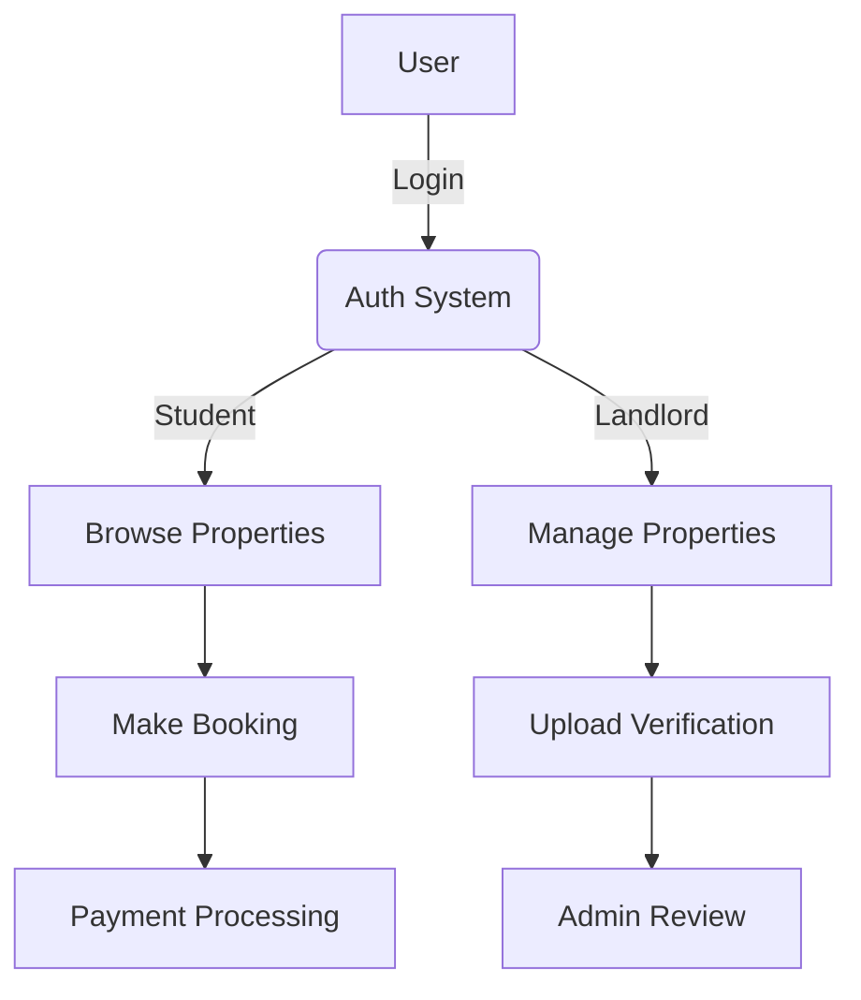
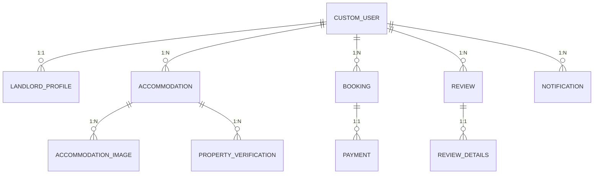

# Chapter 1: Project Introduction

## 1.1 Project Introduction
The Student Housing Platform is a comprehensive web-based solution designed to streamline the process of finding, listing, and managing student accommodation. The system connects students seeking verified, safe, and affordable housing with landlords who wish to list and manage their properties efficiently. The platform supports a full property lifecycle, from listing and verification to booking, payment, and review, with robust authentication and role-based access for students and landlords.

## 1.2 Project Approach / Model Followed
This project follows the **Waterfall Model** of software development. The process includes:
- **Requirements Gathering:** Detailed interviews and surveys with stakeholders (students, landlords, admins).
- **System Design:** Architectural, database, and UI/UX design.
- **Implementation:** Coding in Django, PostgreSQL, and integration with third-party services.
- **Testing:** Unit, integration, and user acceptance testing.
- **Deployment:** Launch on a secure server with ongoing maintenance.

The Waterfall Model ensures each phase is completed before moving to the next, providing clear documentation and checkpoints for quality assurance.

## 1.3 Scope of the Project
- **User Roles:** Student, Landlord, Admin.
- **Core Features:**
  - User registration, login, and authentication.
  - Landlord property listing, editing, and verification.
  - Student property search, booking, and review.
  - Payment processing for subscriptions and bookings.
  - Admin review of property verification documents.
- **Integrations:** Cloudinary for media storage, PayPal for payments.

## 1.4 Feasibility Study
### Technical Feasibility
- The platform uses Django, a mature and scalable Python web framework.
- PostgreSQL ensures robust data storage.
- Cloudinary and PayPal provide scalable, secure third-party integrations.
- The system is compatible with modern web browsers and cloud/on-premise deployment.

### Economic Feasibility
- Open-source stack minimizes licensing costs.
- Cloudinary and PayPal offer scalable, usage-based pricing.
- Minimal hardware investment is required for deployment.

### Organisational Feasibility
- Designed for universities, student organizations, or property management firms.
- Supports multiple user roles and scalable to thousands of users.

## 1.5 Hardware and Software Requirements
| Requirement    | Specification                           |
|----------------|-----------------------------------------|
| Hardware       | Standard PC/server, 4GB RAM+, 2GHz CPU+ |
| OS             | Windows, Linux, or macOS                |
| Backend        | Python 3.10+, Django 5.1                |
| Database       | PostgreSQL 12+                          |
| Frontend       | HTML5, Tailwind CSS                     |
| Media Storage  | Cloudinary account                      |
| Payments       | PayPal developer account                |
| Browser        | Chrome, Firefox, Edge                   |

## 1.6 Project Timeframe (Gantt Chart)
| Task                       | Start Date | End Date   | Duration (weeks) |
|----------------------------|------------|------------|------------------|
| Requirements Analysis      | 2025-03-01 | 2025-03-07 | 1                |
| System Design              | 2025-03-08 | 2025-03-21 | 2                |
| Implementation             | 2025-03-22 | 2025-04-18 | 4                |
| Testing                    | 2025-04-19 | 2025-04-25 | 1                |
| Deployment & Documentation | 2025-04-26 | 2025-04-30 | 1                |

*(Insert a Gantt chart here using Word's chart tools or an image from an online Gantt tool.)*

---

# Chapter 2: System Analysis

## 2.1 Requirements Specifications
### Functional Requirements
- Users can register/login as Student or Landlord.
- Landlords can list, edit, and verify properties.
- Students can search, book, and review properties.
- Payments for subscriptions and bookings are processed securely.
- Admin can review property verification documents.

### Non-Functional Requirements
- Secure authentication and data storage.
- Responsive UI for desktop and mobile.
- Scalable media and payment integrations.

## 2.2 Use Case Analysis
**Actors:** Student, Landlord, Admin

| Use Case              | Actor     | Description                                         |
|-----------------------|-----------|-----------------------------------------------------|
| Register/Login        | All       | Users create accounts and log in.                   |
| List/Edit Property    | Landlord  | Landlords add and manage property listings.         |
| Verify Property       | Landlord  | Landlords upload verification documents.            |
| Search/Book Property  | Student   | Students search for and book accommodations.        |
| Payment Processing    | All       | Users make payments for subscriptions/bookings.     |
| Review Accommodation  | Student   | Students leave reviews for properties.              |
| Admin Review          | Admin     | Admin reviews verification documents.               |

## 2.3 Process Modelling (Data Flow Diagram)
*(Insert as image in Word. Use Mermaid code below in Mermaid Live Editor to export.)*



## 2.4 Data Modelling (ER Diagram)
*(Insert as image in Word. Use Mermaid code below in Mermaid Live Editor to export.)*



---

# Chapter 3: System Design

## 3.1 System Architecture Design
- **MVC Pattern**: Django separates concerns into Models, Views, and Templates.
- **Third-party Integrations**: Cloudinary for media, PayPal for payments.

*(Insert a block diagram showing user, web server, database, cloud services, and payment gateway.)*

## 3.2 User Interface Design
- **Landlord Dashboard**: View listings, add/edit property, see subscription status.
- **Student Dashboard**: Search properties, view bookings, leave reviews.
- **Authentication Pages**: Login, registration, password reset.

*(Include screenshots or wireframes if available.)*

## 3.3 Navigation Design
- Top navigation bar for login/logout, dashboard access.
- Side navigation for dashboard features.

## 3.4 Input Design
- Forms for registration, property listing, booking, verification upload.
- Client-side and server-side validation.

## 3.5 Output Design
- Dynamic property listings, booking confirmations, payment receipts.
- Admin notifications and verification status updates.

## 3.6 Database Design
- See ER Diagram above.
- **Key Tables**: CustomUser, LandlordProfile, Accommodation, Booking, Payment, Review, Notification, PropertyVerificationDocument.

---

# Chapter 4: Implementation

## 4.1 Coding (Sample Code)
**User Login View (Django):**
```python
@csrf_protect
def user_login(request):
    if request.method == 'POST':
        form = CustomAuthenticationForm(request, data=request.POST)
        if form.is_valid():
            user = form.get_user()
            auth_login(request, user)
            redirect_map = {
                'Landlord': 'housing:landlord_home',
                'Student': 'housing:index',
            }
            return redirect(redirect_map.get(user.user_type, settings.LOGIN_REDIRECT_URL))
        else:
            messages.error(request, "Invalid username or password.")
    else:
        form = CustomAuthenticationForm()
    return render(request, 'login-signup/login.html', {'form': form})
```

**Accommodation Model:**
```python
class Accommodation(models.Model):
    landlord = models.ForeignKey(CustomUser, on_delete=models.CASCADE, limit_choices_to={'user_type': 'Landlord'})
    title = models.CharField(max_length=255)
    property_type = models.CharField(max_length=20, choices=PROPERTY_TYPE_CHOICES)
    price = models.DecimalField(max_digits=10, decimal_places=2)
    address = models.CharField(max_length=255)
    is_verified = models.BooleanField(default=False)
    # ... other fields ...
```

## 4.2 Testing
### Preparation of Test Data
- Create test users for each role.
- Add sample properties and bookings.
- Simulate payments with sandbox credentials.

### Unit Testing
- Test individual views and forms for correct validation and output.

### Integration Testing
- Test full user flows: registration → login → property listing/booking → payment.

---

**Appendix:**
- Mermaid code for ERD and DFD can be exported to diagrams using [Mermaid Live Editor](https://mermaid.live/).
- For Gantt chart, use Excel or online Gantt chart tools for visual export.

---

## Formatting Tips
- Insert **page breaks** between chapters in Word.
- Use **Heading 1/2/3** styles for section headers.
- Insert exported diagrams as images.
- Adjust font size and spacing to meet the page count (aim for 3-5 pages per chapter as per most academic templates).
